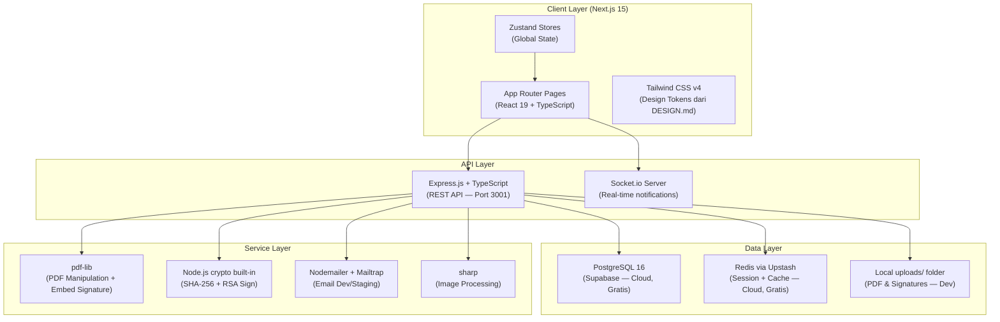
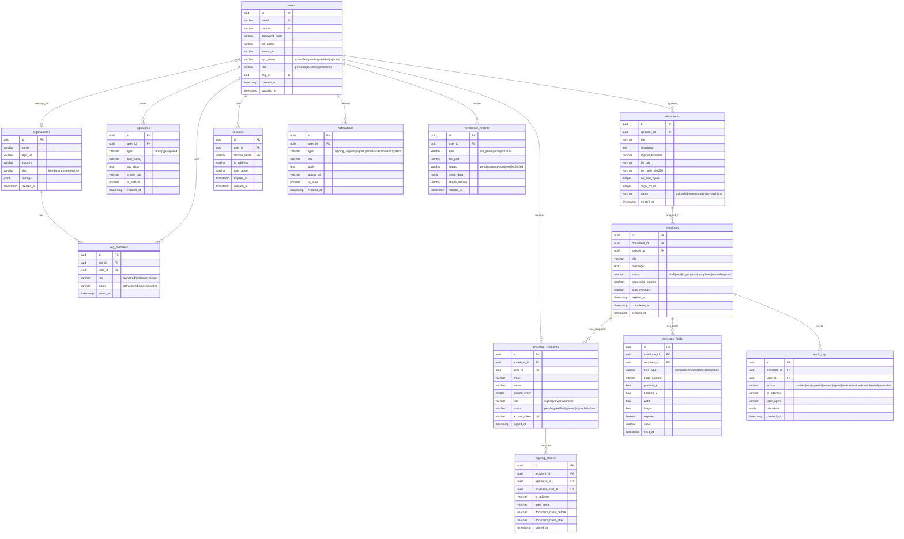

# 🏗️ SecureID — Master Implementation Plan v2.0
> **Versi**: 2.0 — *Master Blueprint (Revised & Hardened)*
> **Tanggal**: 1 April 2026
> **Repository**: [github.com/davidgrcias/secureid](https://github.com/davidgrcias/secureid.git)
> **Status Proyek**: 🔴 Belum dimulai (hanya scaffolding dasar + prototype)

---

## 📌 Current State Assessment

Sebelum kita planning ke depan, gw audit dulu kondisi sekarang:

| Layer | Status | Detail |
|---|---|---|
| `frontend/prototype/` | ✅ Lengkap | 30 folder HTML prototype tersedia sebagai referensi visual |
| `frontend/app/` | 🟡 Scaffolding | Next.js 16 sudah init, tapi hanya `package.json` — belum ada halaman |
| `backend/` | 🔴 Kosong | Hanya `package.json` kosong tanpa dependencies |
| Database | 🔴 Belum ada | Belum ada schema, belum ada koneksi |
| CI/CD | 🔴 Belum ada | Belum ada pipeline |

> [!CAUTION]
> **🚨 DARURAT: AXIOS SUPPLY CHAIN ATTACK (31 MARET 2026) 🚨**
> **JANGAN langsung run `npm install` sembarangan!**
> 
> Versi `axios@1.14.1` & `axios@0.30.4` terkena serangan malware. Ada *hidden dependency* `plain-crypto-js@4.2.1` yang via `postinstall` script akan memasang **Remote Access Trojan (RAT)**. Malware ini bisa mencuri kredensial (keys, password) lalu terhapus sendiri (self-delete) tanpa jejak.
> 
> **Aturan Keamanan Mutlak Proyek Ini:**
> 1. Pastikan `package.json` mengunci **kembali hanya ke `"axios": "1.14.0"`**. (Jangan tambah `^` atau ketik `npm install axios` biasa).
> 2. Biasakan / SELALU jalankan **`npm install --ignore-scripts`** atau ubah npm config `npm config set ignore-scripts true`.
> 3. Package lain (`zustand`, `zod`, `react-hook-form`, dll) terbukti aman, ini khusus serangan bertarget ke `axios` kemarin.
> 
> *Jika terlanjur menginstal versi beracun tersebut di mesin mana pun, anggap kredensial bocor dan segera rotate.*

---

## 🎯 Goal Akhir Proyek

Membangun **SecureID** — platform e-Signature komersial yang:
1. Bisa dipakai untuk **tanda tangan digital** yang sah (UU ITE & PP 71/2019)  
2. Punya **e-KYC flow** (Verifikasi KTP + Selfie + Liveness simulation)  
3. Punya **Document Workflow** lengkap (upload → assign signer → sequential signing → audit trail)  
4. Punya **Enterprise Team Management** dengan RBAC
5. Mobile-responsive dan dark mode compliant
6. **Tanpa Docker** — semua native di lokal

---

## 🏛️ Arsitektur Sistem Final



---

## 📁 Struktur Proyek Final (Monorepo)

```
c:\signature\
├── .gitignore
├── README.md
│
├── frontend/
│   ├── prototype/           ← ⚠️ JANGAN DIUBAH (referensi desain)
│   └── app/                 ← Next.js 15 Application
│       ├── package.json     ← ⚠️ axios sudah pin ke 1.14.0 (AMAN)
│       ├── next.config.ts
│       ├── tailwind.config.ts
│       ├── tsconfig.json
│       ├── postcss.config.js
│       ├── .env.local
│       ├── public/
│       │   └── fonts/
│       └── src/
│           ├── app/                        # App Router
│           │   ├── layout.tsx              # Root layout (font, theme provider)
│           │   ├── (auth)/                 # Route group: Login, Register
│           │   │   ├── login/page.tsx
│           │   │   ├── register/page.tsx
│           │   │   └── forgot-password/page.tsx
│           │   ├── (dashboard)/            # Route group: protected
│           │   │   ├── layout.tsx          # Dashboard layout (nav + sidebar)
│           │   │   ├── dashboard/page.tsx
│           │   │   ├── documents/page.tsx
│           │   │   ├── documents/[id]/page.tsx
│           │   │   └── settings/page.tsx
│           │   ├── (document)/             # Document flow
│           │   │   ├── send/page.tsx       # Upload + Builder
│           │   │   └── send/[id]/builder/page.tsx
│           │   ├── (verification)/         # e-KYC flow
│           │   │   └── verify/page.tsx
│           │   ├── (enterprise)/           # Team management
│           │   │   └── team/page.tsx
│           │   ├── (public)/               # Landing + Pricing
│           │   │   ├── page.tsx            # Landing page (root)
│           │   │   └── pricing/page.tsx
│           │   └── sign/
│           │       └── [token]/page.tsx    # Public signing link
│           ├── components/
│           │   ├── ui/                     # Atom components
│           │   │   ├── Button.tsx
│           │   │   ├── Input.tsx
│           │   │   ├── Modal.tsx
│           │   │   ├── Card.tsx
│           │   │   ├── Badge.tsx
│           │   │   ├── Avatar.tsx
│           │   │   ├── Toast.tsx
│           │   │   └── Skeleton.tsx
│           │   ├── layout/
│           │   │   ├── TopNav.tsx
│           │   │   ├── SideNav.tsx
│           │   │   └── MobileNav.tsx
│           │   ├── document/
│           │   │   ├── PDFViewer.tsx       # react-pdf viewer
│           │   │   ├── AnnotationStudio.tsx # Field drag-drop builder
│           │   │   ├── FieldLayer.tsx      # SVG overlay pada PDF
│           │   │   └── DocumentCard.tsx
│           │   ├── signature/
│           │   │   ├── SignatureModal.tsx   # Draw/Type/Upload tabs
│           │   │   └── SignaturePad.tsx     # react-signature-canvas
│           │   ├── verification/
│           │   │   ├── KTPUpload.tsx
│           │   │   ├── SelfieCapture.tsx
│           │   │   └── LivenessCheck.tsx
│           │   └── dashboard/
│           │       ├── StatsCard.tsx
│           │       └── DocumentTable.tsx
│           ├── lib/
│           │   ├── api.ts                  # Axios instance + interceptors
│           │   ├── auth.ts                 # Auth context & helpers
│           │   ├── pdf-client.ts           # Client PDF utilities
│           │   └── constants.ts            # Design tokens, enums
│           ├── hooks/
│           │   ├── useAuth.ts
│           │   ├── useDocuments.ts
│           │   └── useNotifications.ts
│           ├── stores/
│           │   ├── authStore.ts
│           │   ├── documentStore.ts
│           │   └── uiStore.ts
│           ├── types/
│           │   └── index.ts                # Shared with backend
│           └── styles/
│               └── globals.css             # Tailwind v4 + custom tokens
│
└── backend/
    ├── package.json
    ├── tsconfig.json
    ├── nodemon.json
    ├── .env
    └── src/
        ├── index.ts                        # Express entry point
        ├── config/
        │   ├── database.ts                 # PostgreSQL pool (pg)
        │   ├── redis.ts                    # Upstash Redis client
        │   ├── storage.ts                  # File storage config
        │   └── env.ts                      # Zod-validated env vars
        ├── routes/
        │   ├── auth.routes.ts
        │   ├── user.routes.ts
        │   ├── document.routes.ts
        │   ├── envelope.routes.ts
        │   ├── signature.routes.ts
        │   ├── sign.routes.ts              # Public signing
        │   ├── verification.routes.ts
        │   ├── team.routes.ts
        │   └── notification.routes.ts
        ├── controllers/                    # Thin — hanya handle req/res
        │   └── [*.controller.ts]
        ├── services/                       # Business logic
        │   ├── auth.service.ts
        │   ├── document.service.ts
        │   ├── envelope.service.ts
        │   ├── signature.service.ts        # PDF signing + crypto
        │   ├── verification.service.ts
        │   ├── email.service.ts
        │   └── audit.service.ts
        ├── middleware/
        │   ├── auth.middleware.ts          # JWT validation
        │   ├── upload.middleware.ts        # Multer config
        │   ├── rbac.middleware.ts          # Role check
        │   ├── rateLimiter.middleware.ts   # express-rate-limit
        │   └── error.middleware.ts         # Global error handler
        ├── models/                         # Database queries (typed raw SQL)
        │   └── [*.model.ts]
        ├── utils/
        │   ├── crypto.ts                   # SHA-256, RSA key sign
        │   ├── pdf.ts                      # Server PDF manipulation (pdf-lib)
        │   ├── token.ts                    # JWT helpers
        │   └── validator.ts                # Zod schemas (shared)
        ├── types/
        │   └── index.ts
        └── migrations/
            ├── 001_create_users.sql
            ├── 002_create_organizations.sql
            ├── 003_create_documents.sql
            ├── 004_create_envelopes.sql
            ├── 005_create_signatures.sql
            ├── 006_create_audit_logs.sql
            └── seed.sql
```

---

## 📦 Final Tech Stack + Dependency Manifest

> [!CAUTION]
> **AXIOS SECURITY ALERT**: Selalu install dengan `npm install --ignore-scripts` untuk mencegah postinstall scripts berbahaya. Axios **sudah di-pin ke `1.14.0`** di `package.json` — jangan ubah tanpa konfirmasi.

### Frontend (`frontend/app/`)
```json
{
  "dependencies": {
    "next": "15.2.4",
    "react": "19.0.0",
    "react-dom": "19.0.0",
    "axios": "1.14.0",
    "zustand": "^5.0.3",
    "react-hook-form": "^7.54.2",
    "@hookform/resolvers": "^3.9.1",
    "zod": "^3.24.1",
    "framer-motion": "^11.15.0",
    "react-pdf": "^9.2.1",
    "react-signature-canvas": "^1.0.6",
    "socket.io-client": "^4.8.1",
    "lucide-react": "^0.469.0",
    "clsx": "^2.1.1",
    "date-fns": "^4.1.0"
  },
  "devDependencies": {
    "typescript": "^5.7.3",
    "@types/react": "^19.0.7",
    "@types/react-dom": "^19.0.3",
    "@types/react-signature-canvas": "^1.0.6",
    "tailwindcss": "^4.0.6",
    "@tailwindcss/postcss": "^4.0.6",
    "eslint": "^9.17.0",
    "eslint-config-next": "15.2.4",
    "@typescript-eslint/eslint-plugin": "^8.19.0",
    "prettier": "^3.4.2"
  }
}
```

### Backend (`backend/`)
```json
{
  "dependencies": {
    "express": "^4.21.2",
    "pg": "^8.13.1",
    "@types/pg": "^8.11.10",
    "bcryptjs": "^2.4.3",
    "jsonwebtoken": "^9.0.2",
    "zod": "^3.24.1",
    "multer": "^1.4.5-lts.1",
    "pdf-lib": "^1.17.1",
    "sharp": "^0.33.5",
    "nodemailer": "^6.9.16",
    "@upstash/redis": "^1.34.3",
    "socket.io": "^4.8.1",
    "express-rate-limit": "^7.5.0",
    "helmet": "^8.0.0",
    "cors": "^2.8.5",
    "dotenv": "^16.4.7",
    "morgan": "^1.10.0"
  },
  "devDependencies": {
    "typescript": "^5.7.3",
    "@types/express": "^5.0.0",
    "@types/bcryptjs": "^2.4.6",
    "@types/jsonwebtoken": "^9.0.7",
    "@types/multer": "^1.4.12",
    "@types/nodemailer": "^6.4.17",
    "@types/morgan": "^1.9.9",
    "@types/cors": "^2.8.17",
    "ts-node": "^10.9.2",
    "nodemon": "^3.1.9",
    "prettier": "^3.4.2"
  }
}
```

> [!NOTE]
> **Kenapa tidak pakai Drizzle/Prisma ORM?** Gw pilih **raw typed SQL dengan `pg`** untuk kontrol penuh atas query, menghindari N+1 problems, dan meminimalkan dependencies. Cukup aman untuk proyek ini.

---

## 🗄️ Database Schema (PostgreSQL)

> **Keputusan**: Pakai **Supabase** (cloud, gratis tier) untuk menghindari install PostgreSQL lokal di Windows yang sering ribet. Connection string via `.env`.



---

## 🔌 API Specification (REST)

### Auth
| Method | Endpoint | Auth | Description |
|--------|----------|------|-------------|
| `POST` | `/api/auth/register` | ❌ | Daftar akun baru |
| `POST` | `/api/auth/login` | ❌ | Login → JWT access + refresh |
| `POST` | `/api/auth/refresh` | 🍪 | Refresh access token |
| `POST` | `/api/auth/logout` | ✅ | Invalidate session |
| `POST` | `/api/auth/forgot-password` | ❌ | Kirim reset email |
| `POST` | `/api/auth/reset-password` | ❌ | Reset dengan token |

### Users
| Method | Endpoint | Auth | Description |
|--------|----------|------|-------------|
| `GET` | `/api/users/me` | ✅ | Get profile |
| `PUT` | `/api/users/me` | ✅ | Update profile |
| `POST` | `/api/users/me/avatar` | ✅ | Upload avatar |
| `GET` | `/api/users/me/dashboard` | ✅ | Dashboard stats |

### Documents
| Method | Endpoint | Auth | Description |
|--------|----------|------|-------------|
| `POST` | `/api/documents/upload` | ✅ | Upload PDF |
| `GET` | `/api/documents` | ✅ | List dokumen (paginated) |
| `GET` | `/api/documents/:id` | ✅ | Detail dokumen |
| `GET` | `/api/documents/:id/download` | ✅ | Download file |
| `DELETE` | `/api/documents/:id` | ✅ | Soft delete |

### Envelopes
| Method | Endpoint | Auth | Description |
|--------|----------|------|-------------|
| `POST` | `/api/envelopes` | ✅ | Buat envelope baru |
| `GET` | `/api/envelopes` | ✅ | List envelopes |
| `GET` | `/api/envelopes/:id` | ✅ | Detail + recipients + fields |
| `PUT` | `/api/envelopes/:id` | ✅ | Update draft |
| `POST` | `/api/envelopes/:id/fields` | ✅ | Tambah annotation fields |
| `POST` | `/api/envelopes/:id/send` | ✅ | Kirim ke signers |
| `POST` | `/api/envelopes/:id/void` | ✅ | Void/cancel |
| `POST` | `/api/envelopes/:id/remind` | ✅ | Kirim reminder |
| `GET` | `/api/envelopes/:id/audit` | ✅ | Audit trail |

---

## 🗓️ Phased Implementation Plan

### Phase 0: Foundation & Scaffolding (Minggu 1)
- [ ] Backend scaffold + database connection setup
- [ ] Frontend: UI design system + global layout shell

---

## ❓ Keputusan yang Perlu Dikonfirmasi
1. **DB Hosting**: Supabase (Cloud) or Local Postgres? (Recommendation: Supabase)
2. **Redis**: Upstash (Cloud) or Skip for now? (Recommendation: Upstash)
3. **Email Service**: Mailtrap or Gmail SMTP? (Recommendation: Mailtrap for dev)
4. **ORM**: Raw SQL + pg, or Drizzle/Prisma? (Recommendation: Raw SQL + pg)
5. **Node.js**: Is Next.js 15.2.4 okay for stability? (Next 16 is RC)
6. **Teams**: Solo project or with others?
7. **Start**: Start with Phase 0 now?

---
